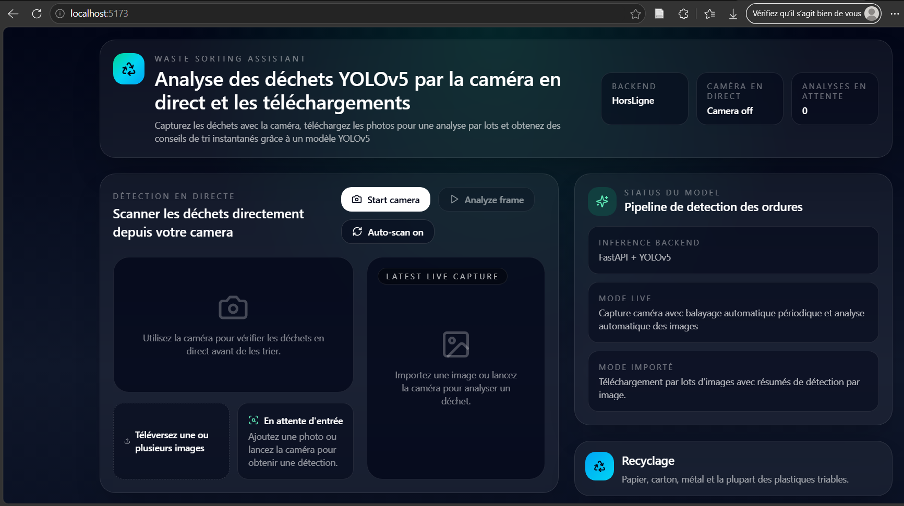

# Smart Waste Sorting Assistant

<p align="center">
  
</p>

<p align="center">
  Assistant intelligent de tri des déchets utilisant l'intelligence artificielle, FastAPI et YOLOv5.
</p>

<p align="center">
  
  
  
  
  
</p>

---

# Présentation

Smart Waste Sorting Assistant est une application web permettant d'identifier automatiquement des déchets à partir :

- d'une photo téléchargée ;
- d'une caméra en direct ;
- d'une capture instantanée.

L'application utilise un modèle YOLOv5 hébergé sur Hugging Face afin de détecter différents types de déchets et proposer automatiquement la bonne filière de tri.

---

# Fonctionnalités

## Détection en direct

- Activation de la webcam.
- Analyse en temps réel.
- Scan automatique périodique.
- Capture manuelle d'image.

## Analyse d'images

- Téléchargement d'une ou plusieurs photos.
- Analyse par lot.
- Détection des objets présents.
- Affichage des boîtes englobantes.

## Recommandation de tri

L'application recommande automatiquement :

| Catégorie             | Exemple                          |
| --------------------- | -------------------------------- |
| Recyclage             | Papier, carton, plastique, métal |
| Bio-déchets           | Restes alimentaires              |
| Verre                 | Bouteilles, bocaux               |
| Déchets spéciaux      | Piles, lampes, électronique      |
| À vérifier localement | Déchets non reconnus             |

## Informations affichées

Pour chaque objet détecté :

- Nom de l'objet
- Score de confiance
- Catégorie de tri
- Conseil de recyclage
- Boîte de détection

---

# Architecture

```text
┌─────────────────────┐
│ Frontend React      │
│ TypeScript + Vite   │
└──────────┬──────────┘
           │ API REST
           ▼
┌─────────────────────┐
│ Backend FastAPI     │
│ YOLOv5 Inference    │
└──────────┬──────────┘
           │
           ▼
┌─────────────────────┐
│ Hugging Face Hub    │
│ yolov5m-garbage     │
└─────────────────────┘
```

---

# Technologies utilisées

## Frontend

- React
- TypeScript
- Vite
- TailwindCSS
- Lucide React

## Backend

- FastAPI
- Python 3.11
- YOLOv5
- Pillow
- Hugging Face Hub

## Intelligence Artificielle

Modèle :

```text
keremberke/yolov5m-garbage
```

---

# Structure du projet

```text
smart-waste-sorting/
│
├── assets/
│   ├── banner.png
│   ├── dashboard.png
│   ├── live-detection.png
│   └── upload-analysis.png
│
├── backend/
│   ├── main.py
│   ├── requirements.txt
│   └── .env
│
├── frontend/
│   ├── src/
│   ├── public/
│   ├── package.json
│   └── vite.config.ts
│
└── README.md
```

---

# Variables d'environnement

## Backend

Créer un fichier `.env`

```env
HF_MODEL_REPO=keremberke/yolov5m-garbage
HF_MODEL_FILE=best.pt

YOLO_IMAGE_SIZE=640
YOLO_CONF=0.25
YOLO_IOU=0.45

HF_TOKEN=xxxxxxxxxxxxxxxx
```

## Frontend

Créer un fichier `.env`

```env
VITE_API_BASE_URL=http://localhost:8000
```

---

# 🚀 Installation

## 1. Cloner le projet

```bash
git clone https://github.com/DanielGlorieux/TriSelect.git

cd ProjetRSE
```

---

## 2. Installation du Backend

Créer l'environnement virtuel :

```bash
python -m venv .venv
```

Activation Windows :

```bash
.venv\Scripts\activate
```

Activation Linux/Mac :

```bash
source .venv/bin/activate
```

Installer les dépendances :

```bash
pip install -r requirements.txt
```

Exemple de requirements.txt :

```txt
fastapi
uvicorn[standard]
python-multipart
pillow
huggingface_hub
yolov5
```

Lancer le serveur :

```bash
uvicorn main:app --reload
```

Le backend sera disponible sur :

```text
http://localhost:8000
```

---

## 3. Installation du Frontend

Installer les dépendances :

```bash
npm install
```

Lancer le projet :

```bash
npm run dev
```

Frontend disponible sur :

```text
http://localhost:5173
```

---

# API

## Vérification de l'état du serveur

### Requête

```http
GET /api/health
```

### Réponse

```json
{
  "ok": true,
  "model_repo": "keremberke/yolov5m-garbage",
  "model_file": "best.pt"
}
```

---

## Analyse d'une image

### Requête

```http
POST /api/predict
```

Type :

```text
multipart/form-data
```

Paramètre :

```text
file=<image>
```

### Exemple de réponse

```json
{
  "model_id": "keremberke/yolov5m-garbage",
  "detections": [
    {
      "label": "plastic bottle",
      "confidence": 0.95,
      "bin": "Recyclage"
    }
  ],
  "summary": {
    "primary_label": "plastic bottle",
    "recommended_bin": "Recyclage"
  }
}
```

---

# Captures d'écran

## Détection en direct


---

## Analyse d'images


---

## Tableau de bord


---

# Sécurité

Les origines autorisées sont :

```python
allow_origins = [
    "http://127.0.0.1:5173",
    "http://localhost:5173",
]
```

À adapter pour la production.

---

# Déploiement

Le projet peut être déployé sur :

- Docker
- AWS ECS Fargate
- AWS EC2
- Railway
- Render
- Azure
- Google Cloud Run

Architecture recommandée :

```text
React
  │
  ▼
Nginx
  │
  ▼
FastAPI
  │
  ▼
YOLOv5
  │
  ▼
Hugging Face Hub
```

---

# Améliorations futures

- Application mobile Android/iOS
- Authentification utilisateur
- Historique des analyses
- Géolocalisation des centres de recyclage
- Tableau de statistiques
- Support multilingue
- Réentraînement du modèle avec un dataset local

---

# Auteur

Développé par Daniel Glorieux Ilboudo.

Projet réalisé dans le cadre de l'utilisation de l'Intelligence Artificielle pour la gestion durable des déchets et la promotion du recyclage.

---

⭐ N'hésitez pas à mettre une étoile au projet si vous le trouvez utile.
